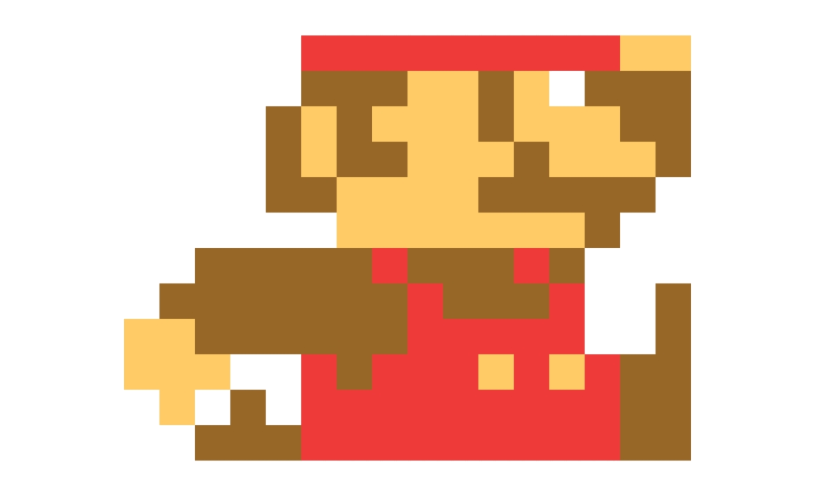
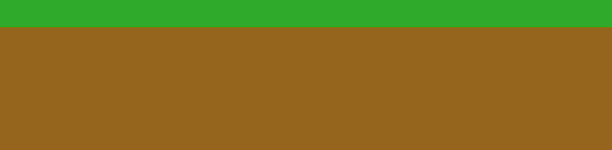

#  Mario-style game 

This sub-repository contains the source code of a mario-style game, written in Python.

Features:
 * Default sprites for player  and ground/platforms 
 * Logic for changing levels, and lives 
 * Define levels in yaml-format

## Run game

```
pip install -r requirements.txt
python main.py
```

## Create a level
Inside `settings/levels.yaml` either replace or add another level in the dictionary (`2:`...).

For each level you can specify:
 1. Platforms - A list of platforms, where each platform is a list of three values `[start_x, end_x, height]` (in pixels).
 2. Holes - A list of holes, where each whole is a list of two values `[start_x, end_x]` (in pixels).
